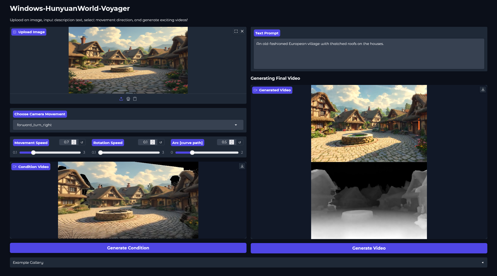

# Windows-HunyuanWorld-Voyager

<p align="center">
  
</p>

<div align="center">
  <a href="https://3d-models.hunyuan.tencent.com/world/" target="_blank"></a>
  <a href="https://3d-models.hunyuan.tencent.com/voyager/voyager_en/assets/HYWorld_Voyager.pdf" target="_blank"></a>
  <a href="https://huggingface.co/tencent/HunyuanWorld-Voyager" target="_blank"></a>
</div>

-----

**Windows-HunyuanWorld-Voyager** is a Windows-native port of HunyuanWorld-Voyager w/ significant improvements & enhancements. This version generates world-consistent 3D point-cloud sequences from a single image w/ user-defined camera paths, fully optimized for Windows systems.

## What's New in Windows-HunyuanWorld-Voyager

This Windows port includes major improvements over the original repository:

### Key Enhancements

**Full Windows Support**
- Complete native Windows compatibility w/ automated `.bat` installation scripts
- Streamlined dependency extraction & installation via `oc_install.bat`
- Proper Windows path handling throughout the codebase
- Resolved FFMPEG compatibility issues for video generation

**Expanded Camera Controls (20+ Movement Types)**

The original repository provided only 6 basic camera movements. This version includes a comprehensive camera system w/ over 20 movement types:

*Basic movements:*
- forward, backward, left, right, up, down

*Pure rotations:*
- turn_left, turn_right, tilt_up, tilt_down

*Combined movements (creates cinematic zoom & pan effects):*
- forward_left, forward_right
- forward_turn_left, forward_turn_right

*Advanced movements:*
- orbit_left, orbit_right
- dolly_zoom_in, dolly_zoom_out (classic Vertigo effect)
- spiral_up, spiral_down
- arc_left, arc_right

*Complex patterns:*
- figure_eight, sine_wave
- custom (user-defined trajectories w/ keyframes)

**Fine-Grained Control Parameters**

Added adjustable parameters for precise camera control:
- Movement speed: 0.1 - 3.0 (controls translational movement velocity)
- Rotation speed: 0.1 - 3.0 (controls rotational movement velocity)
- Arc height: 0.0 - 2.0 (controls height of curved movement paths)
- Custom trajectory support w/ keyframe interpolation (linear, cubic, bezier)

**Improved File Format**
- Replaced `.exr` dependency w/ `.npy` format for better Windows compatibility
- Eliminated external OpenEXR library requirements
- Improved depth processing stability & accuracy
- Fixed depth normalization issues in the original codebase

**GPU Architecture Support**
- Updated PyTorch to 2.7.0 w/ CUDA 12.8 which supports NVIDIA Blackwell architecture GPUs (SM_120)
- Optimized for modern GPU architectures but is functional w/ older GPUs as long as they have at least 60GBs of VRAM.

**Enhanced Gradio Interface**
- Improved UI w/ intuitive camera control dropdowns
- Real-time parameter adjustment sliders for movement, rotation, & arc height
- Better progress tracking during condition generation
- Fixed video dimension compatibility issues

**Bug Fixes & Improvements**
- Resolved depth buffer processing errors
- Fixed FFMPEG macro_block_size warnings
- Improved error handling & debugging output
- Enhanced depth range calculation & normalization
- Fixed point cloud generation w/ better invalid coordinate handling

### Original Voyager Features

We introduce HunyuanWorld-Voyager, a novel video diffusion framework that generates world-consistent 3D point-cloud sequences from a single image w/ user-defined camera path. Voyager can generate 3D-consistent scene videos for world exploration following custom camera trajectories. It can also generate aligned depth & RGB video for efficient & direct 3D reconstruction.

## 🔥🔥🔥 News!!
* Sep 2, 2025: 👋 We release the code & model weights of HunyuanWorld-Voyager. [Download](ckpts/README.md).
  
* Oct 1, 2025: Windows-HunyuanWorld-Voyager released w/ expanded camera controls, new depth deployment in .npy & full Windows support as well as NVIDIA Blackwell sm_120 support.

> Join our **Wechat** & **Discord** group to discuss & find help from us.

| Wechat Group                                     | Xiaohongshu                                           | X                                           | Discord                                           |
|--------------------------------------------------|-------------------------------------------------------|---------------------------------------------|---------------------------------------------------|
|  |  |  |  | 

## Demo Video

<div align="center">
  <video src="https://github.com/user-attachments/assets/2eb844c9-30ba-4770-8066-189c123affee" width="80%" poster=""> </video>
</div>

### Camera-Controllable Video Generation

|  Input | Generated Video  |
|:----------------:|:----------------:|
|          |       <video src="https://github.com/user-attachments/assets/2b03ecd5-9a8f-455c-bf04-c668d3a61b04" width="100%"> </video>        |
|          |       <video src="https://github.com/user-attachments/assets/45844ac0-c65a-4e04-9f7d-4c72d47e0339" width="100%"> </video>        | 
|          |       <video src="https://github.com/user-attachments/assets/f7f48473-3bb5-4a30-bd22-af3ca95ee8dc" width="100%"> </video>        |

### Multiple Applications

- Video Reconstruction

| Generated Video | Reconstructed Point Cloud |
|:---------------:|:--------------------------------:|
| <video src="https://github.com/user-attachments/assets/72a41804-63fc-4596-963d-1497e68f7790" width="100%"> </video> | <video src="https://github.com/user-attachments/assets/67574e9c-9e21-4ed6-9503-e65d187086a2" width="100%"> </video> |

- Image-to-3D Generation

| | |
|:---------------:|:---------------:|
| <video src="https://github.com/user-attachments/assets/886aa86d-990e-4b86-97a5-0b9110862d14" width="100%"> </video> | <video src="https://github.com/user-attachments/assets/4c1734ba-4e78-4979-b30e-3c8c97aa984b" width="100%"> </video> |

- Video Depth Estimation

| | |
|:---------------:|:---------------:|
| <video src="https://github.com/user-attachments/assets/e4c8b729-e880-4be3-826f-429a5c1f12cd" width="100%"> </video> | <video src="https://github.com/user-attachments/assets/7ede0745-cde7-42f1-9c28-e4dca90dac52" width="100%"> </video> |


## HunyuanWorld-Voyager Introduction

###  Architecture

Voyager consists of two key components:

(1) World-Consistent Video Diffusion: A unified architecture that jointly generates aligned RGB & depth video sequences, conditioned on existing world observation to ensure global coherence.

(2) Long-Range World Exploration: An efficient world cache w/ point culling & an auto-regressive inference w/ smooth video sampling for iterative scene extension w/ context-aware consistency.

To train Voyager, we propose a scalable data engine, i.e., a video reconstruction pipeline that automates camera pose estimation & metric depth prediction for arbitrary videos, enabling large-scale, diverse training data curation without manual 3D annotations. Using this pipeline, we compile a dataset of over 100,000 video clips, combining real-world captures & synthetic Unreal Engine renders.

<p align="center">
  
</p>

### Performance

<table class="comparison-table">
  <thead>
    <tr>
      <th>Method</th>
      <th>WorldScore Average</th>
      <th>Camera Control</th>
      <th>Object Control</th>
      <th>Content Alignment</th>
      <th>3D Consistency</th>
      <th>Photometric Consistency</th>
      <th>Style Consistency</th>
      <th>Subjective Quality</th>
    </tr>
  </thead>
  <tbody>
    <tr>
      <td>WonderJourney</td>
      <td>63.75</td>
      <td>84.6</td>
      <td>37.1</td>
      <td>35.54</td>
      <td>80.6</td>
      <td>79.03</td>
      <td>62.82</td>
      <td>66.56</td>
    </tr>
    <tr>
      <td>WonderWorld</td>
      <td>72.69</td>
      <td>92.98</td>
      <td>51.76</td>
      <td>71.25</td>
      <td>86.87</td>
      <td>85.56</td>
      <td>70.57</td>
      <td>49.81</td>
    </tr>
    <tr>
      <td>EasyAnimate</td>
      <td>52.85</td>
      <td>26.72</td>
      <td>54.5</td>
      <td>50.76</td>
      <td>67.29</td>
      <td>47.35</td>
      <td>73.05</td>
      <td>50.31</td>
    </tr>
    <tr>
      <td>Allegro</td>
      <td>55.31</td>
      <td>24.84</td>
      <td>57.47</td>
      <td>51.48</td>
      <td>70.5</td>
      <td>69.89</td>
      <td>65.6</td>
      <td>47.41</td>
    </tr>
    <tr>
      <td>Gen-3</td>
      <td>60.71</td>
      <td>29.47</td>
      <td>62.92</td>
      <td>50.49</td>
      <td>68.31</td>
      <td>87.09</td>
      <td>62.82</td>
      <td>63.85</td>
    </tr>
    <tr>
      <td>CogVideoX-I2V</td>
      <td>62.15</td>
      <td>38.27</td>
      <td>40.07</td>
      <td>36.73</td>
      <td>86.21</td>
      <td>88.12</td>
      <td>83.22</td>
      <td>62.44</td>
    </tr>
    <tr class="voyager-row">
      <td><b>Voyager</b></td>
      <td><b>77.62</b></td>
      <td><b>85.95</b></td>
      <td><b>66.92</b></td>
      <td><b>68.92</b></td>
      <td><b>81.56</b></td>
      <td><b>85.99</b></td>
      <td><b>84.89</b></td>
      <td><b>71.09</b></td>
    </tr>
  </tbody>
  <caption>Quantitative comparison on <i>WorldScore Benchmark</i>.</caption>
</table>


## Requirements

The following table shows the requirements for running Voyager (batch size = 1) to generate videos:

|      Model       | Resolution  | GPU Peak Memory  |
|:----------------:|:-----------:|:----------------:|
| HunyuanWorld-Voyager |    540p     |       60GB        |

* An NVIDIA GPU w/ CUDA support is required. 
  * The model is tested on a single 80G GPU.
  * **Minimum**: The minimum GPU memory required is 60GB for 540p.
  * **Recommended**: We recommend using a GPU w/ 80GB of memory for better generation quality.
* Tested operating system: **Windows 10/11** (this port) w/ an RTX Pro 6000, Linux (original)
* **7-Zip** is required for automated installation (can be downloaded from https://www.7-zip.org/)


## Dependencies & Installation (Windows)

### Prerequisites

1. **Install 7-Zip** from https://www.7-zip.org/ (required for automated dependency extraction)
2. **NVIDIA GPU** w/ CUDA support (60GB+ VRAM recommended)
3. **Python 3.10** (via Anaconda/Miniconda recommended)

### Installation Steps

Begin by cloning the repository:
```cmd
git clone https://github.com/MackinationsAi/Windows-HunyuanWorld-Voyager.git
cd Windows-HunyuanWorld-Voyager
```

### Download Required Files

Before installation, download the pre-packaged dependencies from this GitHub release [here](https://github.com/MackinationsAi/Windows-HunyuanWorld-Voyager/releases/tag/Packages-v0.0.1):

**Packages-v0.0.1 Release**

Download all 4 `.7z` files & place them in the following locations:
- `data_engine/Metric3D.7z`
- `data_engine/MoGe.7z`
- `data_engine/vggt.7z`
- `Windows-HunyuanWorld-Voyager/dep_whls.7z`

The `oc_install.bat` script will automatically extract these files during installation.

**Automated Installation**

Simply run the installation script:
```cmd
oc_install.bat
```

This script will:
1. Creates a Python virtual environment
2. Installs all requirement.txt deps
4. Installs PyTorch 2.7.0 w/ CUDA 12.8 support
5. Extracts all `.7z` dependency files & whls
6. Installs Flash Attention 2 & Deepspeed for windows
7. Cleans up `.7z` files after successful extraction


### Installation Notes

- **CUDA Version**: This port uses CUDA 12.8 for Blackwell architecture support. If you have an older GPU it will work as long as you have 60GBs+ of VRAM on the card.
- **Flash Attention**: The custom-built wheel supports Windows & is optimized for the PyTorch version & is included in the `dep_whls.7z` folder.
- **DeepSpeed**: The custom-built Windows wheel is also included in the `dep_whls.7z` folder.


## Download Pretrained Models

Download pretrained models from huggingface, & take all of the models & place them directly in the `ckpts` folder:

```cmd
huggingface-cli download tencent/HunyuanWorld-Voyager --local-dir ./ckpts
```

The `ckpts` folder should look exactly like this - A detailed guidance for downloading pretrained models is shown [here](ckpts/README.md).

```
Windows-HunyuanWorld-Voyager/ckpts/
├── .gitattributes
├── LICENSE
├── NOTICE
├── README_model.md      # can be renamed or removed
├── Voyager
│   ├── config.json
│   └── transformers
│       ├── mp_rank_00_model_states.pt
│       └── mp_rank_00_model_states_context.pt
├── assets
│   └── HYWorld_Voyager.pdf
├── config.json
├── hunyuan-video-i2v-720p
│   └── vae
│       ├── config.json
│       └── pytorch_model.pt
├── text_encoder_2
│   ├── .gitattributes
│   ├── README.md
│   ├── config.json
│   ├── flax_model.msgpack
│   ├── merges.txt
│   ├── model.safetensors
│   ├── preprocessor_config.json
│   ├── pytorch_model.bin
│   ├── special_tokens_map.json
│   ├── tf_model.h5
│   ├── tokenizer.json
│   ├── tokenizer_config.json
│   └── vocab.json
└── text_encoder_i2v
    ├── .gitattributes
    ├── README.md
    ├── config.json
    ├── generation_config.json
    ├── model-00001-of-00004.safetensors
    ├── model-00002-of-00004.safetensors
    ├── model-00003-of-00004.safetensors
    ├── model-00004-of-00004.safetensors
    ├── model.safetensors.index.json
    ├── preprocessor_config.json
    ├── special_tokens_map.json
    ├── tokenizer.json
    └── tokenizer_config.json
```


## Inference

### Create Input Condition

We provide several input examples in the `examples` folder. You can find the corresponding input text in the `prompt.txt` file. If you'd like to use your own input image, you can run the following command:

```cmd
cd data_engine

python create_input.py --image_path "your_input_image.png" --render_output_dir "../examples/case/" --type "forward"
```

**Available Camera Movement Types:**

This Windows port provides extensive camera control options:

**Basic Movements:**
- `forward`, `backward`, `left`, `right`, `up`, `down`

**Pure Rotations:**
- `turn_left`, `turn_right` - Horizontal rotation
- `tilt_up`, `tilt_down` - Vertical rotation
- `360_rotation_left`, `360_rotation_right` - Full 360-degree spin

**Combined Movements (Cinematic):**
- `forward_left`, `forward_right` - Forward movement w/ lateral drift
- `forward_turn_left`, `forward_turn_right` - Forward movement w/ rotation (creates zoom & pan effect)

**Advanced Movements:**
- `orbit_left`, `orbit_right` - Circular orbit around center point
- `dolly_zoom` - Classic Vertigo/dolly zoom effect
- `spiral_up`, `spiral_down` - Spiral movement w/ vertical motion
- `arc_left`, `arc_right` - Arc-shaped curved movement

**Complex Patterns:**
- `figure_eight` - Figure-8 pattern movement
- `sine_wave` - Sinusoidal wave pattern
- `custom` - User-defined trajectory w/ keyframes

**Advanced Parameters:**

You can also customize the camera movement w/ additional parameters:

```cmd
python create_input.py \
    --image_path "your_image.png" \
    --render_output_dir "../examples/custom/" \
    --type "forward_turn_left"
```

Or modify the `camera_list()` function call in `create_input.py` to adjust:
- `movement_speed`: 0.1 - 3.0 (default: 1.0)
- `rotation_speed`: 0.1 - 3.0 (default: 1.0)
- `arc_height`: 0.0 - 2.0 (default: 0.0)

### Quick Start w/ Batch Files

For convenience, we provide Windows batch files for quick execution:

**Generate Video (Single GPU):**
```cmd
boot_voyager.bat
```

**Launch Gradio Interface:**
```cmd
boot_voyager_app.bat
```

These batch files automatically activate the virtual environment & run the appropriate scripts w/ pre-configured settings.

### Single-GPU Inference

```cmd
cd Windows-HunyuanWorld-Voyager

python sample_image2video.py ^
    --model HYVideo-T/2 ^
    --input-path "examples/case1" ^
    --prompt "An old-fashioned European village w/ thatched roofs on the houses." ^
    --i2v-stability ^
    --infer-steps 50 ^
    --flow-reverse ^
    --flow-shift 7.0 ^
    --seed 0 ^
    --embedded-cfg-scale 6.0 ^
    --use-cpu-offload ^
    --save-path ./results
```

You can add `--use-context-block` to add the context block in the inference.

### Parallel Inference on Multiple GPUs by xDiT

[xDiT](https://github.com/xdit-project/xDiT) is a Scalable Inference Engine for Diffusion Transformers (DiTs) on multi-GPU Clusters.
It has successfully provided low-latency parallel inference solutions for a variety of DiTs models, including mochi-1, CogVideoX, Flux.1, SD3, etc. This repo adopted the [Unified Sequence Parallelism (USP)](https://arxiv.org/abs/2405.07719) APIs for parallel inference of the HunyuanVideo-I2V model.

For example, to generate a video w/ 8 GPUs, you can use the following command:

```cmd
set ALLOW_RESIZE_FOR_SP=1

python -m torch.distributed.run --nproc_per_node=8 ^
    sample_image2video.py ^
    --model HYVideo-T/2 ^
    --input-path "examples/case1" ^
    --prompt "An old-fashioned European village w/ thatched roofs on the houses." ^
    --i2v-stability ^
    --infer-steps 50 ^
    --flow-reverse ^
    --flow-shift 7.0 ^
    --seed 0 ^
    --embedded-cfg-scale 6.0 ^
    --save-path ./results ^
    --ulysses-degree 8 ^
    --ring-degree 1
```

The number of GPUs equals the product of `--ulysses-degree` & `--ring-degree.` Feel free to adjust these parallel configurations to optimize performance.

<p align="center">
<table align="center">
<thead>
<tr>
    <th colspan="4">Latency (Sec) for 512x768 (49 frames 50 steps) on 8 x H20 GPU</th>
</tr>
<tr>
    <th>1</th>
    <th>2</th>
    <th>4</th>
    <th>8</th>
</tr>
</thead>
<tbody>
<tr>
    <th>1925</th>
    <th>1018 (1.89x)</th>
    <th>534 (3.60x)</th>
    <th>288 (6.69x)</th>
</tr>

</tbody>
</table>
</p>

### Gradio Demo

We provide an enhanced Gradio demo w/ full camera control options:

<p align="center">
  
</p>

Launch the demo:
```cmd
venv\scripts\activate
python app.py
```

Or simply use the batch file:
```cmd
boot_voyager_app.bat
```

**Features:**
1. Upload an input image
2. Select from 20+ camera movement types
3. Adjust movement speed, rotation speed, & arc height w/ sliders
4. Generate condition video preview
5. Enter text prompt describing the scene
6. Generate final RGB-D video

The demo will be accessible at `http://localhost:7860`

### Export Point Cloud

After generating RGB-D video content, you can export `.ply` file as follows:
```cmd
cd data_engine

python convert_point.py --folder_path "your_input_condition_folder" --video_path "your_output_video_path"
```

## Data Engine

We also release the data engine of HunyuanWorld-Voyager, which can be used to generate scalable data for RGB-D video training. Please refer to [data_engine](data_engine/README.md) for more details.

<p align="center">
  
</p>

## Troubleshooting

**Common Issues:**

1. **7-Zip not found**: Install 7-Zip from https://www.7-zip.org/ & ensure it's in your PATH or update the path in `oc_install.bat`

2. **CUDA out of memory**: Reduce batch size or use `--use-cpu-offload` flag

3. **FFMPEG warnings**: The code now handles video dimensions to be divisible by 16, eliminating most FFMPEG warnings

4. **Depth processing errors**: Ensure input images are valid & contain sufficient detail for depth estimation

5. **Missing .7z files**: Download all 4 `.7z` files from the GitHub release & place them in the correct directories before running `oc_install.bat`

## BibTeX

If you find [Voyager](https://arxiv.org/abs/2506.04225) useful for your research & applications, please cite using this BibTeX:

```BibTeX
@article{huang2025voyager,
  title={Voyager: Long-Range & World-Consistent Video Diffusion for Explorable 3D Scene Generation},
  author={Huang, Tianyu & Zheng, Wangguandong & Wang, Tengfei & Liu, Yuhao & Wang, Zhenwei & Wu, Junta & Jiang, Jie & Li, Hui & Lau, Rynson WH & Zuo, Wangmeng & Guo, Chunchao},
  journal={arXiv preprint arXiv:2506.04225},
  year={2025}
}
```

## Acknowledgements

We would like to thank [HunyuanWorld](https://github.com/Tencent-Hunyuan/HunyuanWorld-1.0), [Hunyuan3D](https://github.com/Tencent-Hunyuan/Hunyuan3D-2), & [HunyuanVideo](https://github.com/Tencent-Hunyuan/HunyuanVideo-I2V). We also thank [VGGT](https://github.com/facebookresearch/vggt), [MoGE](https://github.com/microsoft/MoGe), [Metric3D](https://github.com/YvanYin/Metric3D), & [xDiT](https://github.com/xdit-project/xDiT) for their open research & exploration.

[MackinationsAi](https://github.com/MackinationsAi) for the Windows port enhancements, expanded camera controls, & improved depth processing pipeline for windows.
